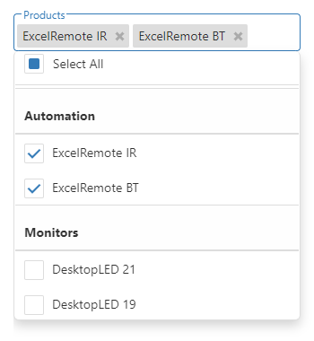

<!-- default badges list -->

<!-- default badges end -->
# DevExtreme TagBox - Getting Started 

This repository stores the code examples of the TagBox component for the [Getting Started with TagBox](https://js.devexpress.com/Documentation/Guide/UI_Components/TagBox/Getting_Started_with_TagBox/) tutorial. The TagBox is an editor that allows users to select multiple items from a drop-down list. This tutorial explains how to add a TagBox to a page, populate the drop-down list, allow users to search through it, and log the data of the selected item in the console.

## Files to Review

- **Angular**
    - [app.component.html](Angular/src/app/app.component.html)
    - [app.component.ts](Angular/src/app/app.component.ts)
- **jQuery**
    - [index.js](jQuery/src/index.js)
- **React**
    - [App.js](React/src/App.js)
- **Vue**
    - [App.vue](Vue/src/App.vue)

## Documentation

- [Getting Started with TagBox](https://js.devexpress.com/Documentation/Guide/UI_Components/TagBox/Getting_Started_with_TagBox/)

- [TagBox - API Reference](https://js.devexpress.com/Documentation/ApiReference/UI_Components/dxTagBox/)
<!-- feedback -->
## Does this example address your development requirements/objectives?

 

(you will be redirected to DevExpress.com to submit your response)
<!-- feedback end -->
